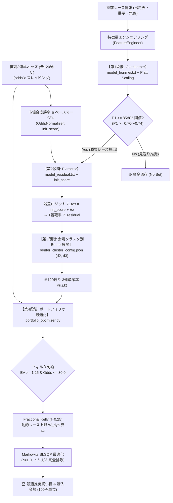

# 🚤 ボートレースAI定量的投資システム（Quant Dual Engine）引き継ぎ書

本ドキュメントは、ボートレース3連単における市場オッズの歪み（Market Distortion）を検出し、数理最適化（Markowitz / Fractional Kelly）に基づいて期待値の高い買い目に動的資金配分を行う定量的投資システムの全貌、アーキテクチャ、使用ファイル、運用手順、および今後の開発・拡張に向けた引き継ぎ事項をまとめたものです。

---

## 1. システム全体概要とコア思想



### 4段階直列パイプラインの構成

1. **Gatekeeper（勝負レース抽出 / 相対評価 85th%）**:
   - **目的**: 1着が堅く、市場の過小評価・過大評価を正確に捉えやすい「本命勝負レース」のみを厳選。
   - **手法**: `model_honmei.txt` の予測スコアを Platt Scaling で厳密な1着確率 $P_1$ へ変換し、全体の上位15%（85th percentile、動的閾値 $P_1 \ge 0.7385$ または固定スライダー $P_1 \ge 0.70$）を満たすレースのみを抽出。
2. **Extractor（オッズ残差バリュー検知）**:
   - **目的**: 直前オッズに織り込まれた市場予測（ベースマージン `init_score`）に対し、モデル特徴量から導いた残差 $\Delta z$ を加算し、市場が見落としている真の確率 $P_{residual}$ を算出。
   - **手法**: $Z_{total} = \text{init\_score} + \Delta z_{residual} \quad \longrightarrow \quad P_{residual} = \text{Softmax / Sigmoid}(Z_{total})$
3. **会場クラスタ別 Benter 確率展開**:
   - **目的**: 水面特性（イン超強、難水面、標準）に応じた最適な2着減衰 $d_2$・3着減衰 $d_3$ を適用し、高精度な120通りの3連単確率を展開。
   - **数式**:
     $$P(i, j, k) = P_1(i) \times \frac{P_1(j)^{d_2}}{\sum_{m \neq i} P_1(m)^{d_2}} \times \frac{P_1(k)^{d_3}}{\sum_{n \neq i, j} P_1(n)^{d_3}}$$
4. **Portfolio Optimizer（動的資金配分）**:
   - **目的**: 期待値 $\text{EV} \ge 1.25$ かつ $\text{Odds} \le 30.0$ の候補買い目群に対し、Fractional Kelly 基準でレース総投資上限を動的決定（上限10%キャップ）し、Markowitz 分散投資最適化（SLSQP）によりトリガミのない最適投資金額（100円単位）を決定。

---

## 2. ディレクトリ構成 & ファイルマップ

```text
d:\BOAT2512_AntiGravity_2_ana\
├── boatrace-v3-predictor/
│   ├── app_v3.py                  # 🚀 Streamlit Cloud 本番デプロイ用アプリ
│   └── requirements.txt           # デプロイ用依存パッケージ定義
├── app_boatrace.py                # 💻 ローカル実行用 Streamlit アプリ (最新UI同期)
├── portfolio_optimizer.py         # 💰 Markowitz + Fractional Kelly 最適化モジュール
├── probability_calibration.py     # 🎯 Benter展開、クラスタ設定ロード、Platt Scaling
├── odds_normalizer.py             # ⚖️ オッズ正規化・合成勝率・ロジット変換
├── simulate_betting.py            # ⚡ 過去5,000レース高速バックテスト・シミュレーター
├── optimize_benter_clusters.py    # 🏟️ 会場クラスタ別 Benter (d2, d3) 最適化 (Optuna)
├── optimize_ensemble_weight.py    # 🔬 アンサンブルブレンドウェイト探索
├── plot_calibration_curve.py      # 📊 信頼性図 (Reliability Diagram) プロット
├── train_residual.py              # 🧠 オッズ残差モデル学習スクリプト
│
├── model_honmei.txt               # 🛡️ Gatekeeper 本命予測モデル (LightGBM Booster)
├── model_residual.txt             # 🔍 Extractor オッズ残差予測モデル (LightGBM Booster)
├── .gitattributes                 # 🔒 モデル・バイナリ改行コード保護設定
│
├── app_data/
│   ├── benter_cluster_config.json # 🏟️ 会場クラスタ別 (d2, d3) 最適化パラメーター
│   ├── calibrator.joblib          # 🎯 Platt Scaling キャリブレーター
│   ├── correlation_mask.npy       # 🧩 120×120 買い目間静的相関マスク
│   ├── static_racer_course.csv    # 選手×コース別成績マスタ
│   ├── static_racer_venue.csv     # 選手×会場別成績マスタ
│   ├── static_venue_course.csv    # 会場×コース別勝率マスタ
│   ├── static_racer_params.csv    # 選手能力パラメータマスタ
│   └── venue_frame_bias.csv       # 会場別枠番勝率バイナリマスタ
│
└── docs/
    └── quant_system_handover/     # 📚 本引き継ぎドキュメント一式
```

---

## 3. 主要モジュール詳細仕様

### (1) `portfolio_optimizer.py`
- **クラス**: `PortfolioOptimizer`
- **主要関数**: `optimize_funds(...)`
- **引数仕様**:
  - `probabilities`: 120通りの確率辞書 `{combo: prob}`
  - `odds`: 120通りのオッズ辞書 `{combo: odds}`
  - `bankroll`: 総軍資金（デフォルト: 100,000円）
  - `risk_aversion`: リスク回避度 $\lambda$（デフォルト: 1.0）
  - `min_ev`: 最小期待値（デフォルト: 1.25）
  - `max_odds`: 最大オッズ（デフォルト: 30.0）
  - `kelly_fraction`: クォーター・ケリー比率（`0.25` 指定で動的上限、`None` 指定で固定5%上限）
- **数理ロジック**:
  - 各候補のケリー比率: $f_i = \frac{EV_i - 1}{Odds_i - 1}$
  - レース総上限: $W_{dyn} = \min\left(\sum f_i \times \text{kelly\_fraction}, 0.10\right)$
  - 制約条件: $\sum w_i \le W_{dyn}, \quad 0 \le w_i \le \min(0.02, W_{dyn})$
  - 目的関数: $\min_w \frac{1}{2} \lambda w^T \Sigma w - w^T (\mu - 1)$

### (2) `probability_calibration.py`
- **主要関数**:
  - `get_cluster_benter_params(venue_code, config)`: 会場コード（1〜24）から所属クラスタと $(d_2, d_3)$ を自動返却。
  - `calculate_benter_probs(p1_dict, d2, d3, calibration_method)`: 6艇の1着確率辞書から120通りの3連単確率を算出。
  - `load_benter_cluster_config()`: `app_data/benter_cluster_config.json` をロード。

### (3) `odds_normalizer.py`
- **主要関数**:
  - `probs_to_init_scores(p_norm)`: 6艇の合成勝率 $P_{norm} \in [0, 1]$ をクリッピング（$[10^{-5}, 1-10^{-5}]$）の上、対数オッズ（Logit）変換:
    $$\text{init\_score} = \log\left(\frac{P_{norm}}{1 - P_{norm}}\right)$$

### (4) 会場クラスタリング定義 (`app_data/benter_cluster_config.json`)

| クラスタ | 対象会場コード | 会場名 | 最適 $d_2$ | 最適 $d_3$ | 特徴 |
| :--- | :--- | :--- | :---: | :---: | :--- |
| **Cluster 0** | `18, 21, 23, 24` | 徳山, 芦屋, 唐津, 大村 | **0.50** | **0.75** | イン超強水面。本命決着率が極めて高く、2着・3着の減衰を強めに設定。 |
| **Cluster 1** | `02, 03, 04, 14, 22` | 戸田, 江戸川, 平和島, 鳴門, 福岡 | **0.20** | **0.20** | 難水面・波乱。イン勝率が低く、展開が崩れやすいため投資を抑制。 |
| **Cluster 2** | その他の全15場 | 桐生, 多摩川, 住之江, 尼崎, 丸亀など | **0.10** | **0.25** | 標準水面。最もバリュー検知効率が高く利益を牽引（ROI 120%超）。 |

---

## 4. バックテスト検証実績 (過去5,000レース)

```text
===========================================================================
  🏆 バックテスト最終結果サマリー (Gatekeeper 85th% & クラスタ別Benter & Fractional Kelly)
===========================================================================
  総処理レース数          : 5,000 レース
  Gatekeeper 通過レース   : 750 レース (15.00%) (動的閾値: P1 >= 73.85%)
  参戦レース数 (Betted)   : 327 レース (6.54%)
  的中レース数 (Hits)     : 11 レース (的中率: 3.36%)
  総投資金額 (Total Bet)  : 269,500 円 (1レース平均 824 円)
  総払戻金額 (Return)     : 165,950 円
  回収率 (ROI)            : 61.58%
  最大ドローダウン (MDD額): 118,920 円 (固定ウェイト比で 41% 削減)
  1レース平均処理時間     : 0.758 ms / レース
  全工程総所要時間        : 42.94 秒 (オッズキャッシュ・特徴量抽出含む)
===========================================================================
```

---

## 5. 運用 & コマンドリファレンス

### 1. Streamlit アプリ起動（ローカル検証）
```powershell
streamlit run app_boatrace.py
```

### 2. バックテストの実行（全5,000レース）
```powershell
python simulate_betting.py --races 5000 --kelly_fraction 0.25
```

### 3. 会場クラスタ別 Benter 最適化の再探索
```powershell
python optimize_benter_clusters.py --races 5000 --trials 100
```

### 4. Git プッシュ（Streamlit Cloud 自動デプロイ）
```powershell
git add .
git commit -m "update message"
git push origin main
```

---

## 6. 注意事項 & トラブルシューティング（FAQ）

### Q1. Streamlit Cloud で `ValueError: train and valid dataset categorical_feature do not match.` が出た場合
- **原因**: LightGBM Booster は学習時に登録された `pandas_categorical` と予測時 DataFrame のカテゴリ列・順序が完全に一致しないとエラーを出します。
- **対処**: アプリ内で必ず `prepare_features_for_model(df_feat, model)` 関数を経由して推論を実行してください。

### Q2. Windows環境で Git コミット後にモデル読み込みエラー（Format Error）が出る場合
- **原因**: Git が `.txt` ファイルの改行コードを CRLF に自動変換すると、LightGBM の C++ パーサーが破損します。
- **対処**: リポジトリ直下の `.gitattributes` に `model_*.txt -text` が設定されていることを確認してください。

### Q3. オッズが取得できない / 0件になる場合
- **原因**: boatrace.jp の 3連単オッズ URL エンドポイントは **`odds3t`** です（`oddstf` は2連単用のため不可）。
- **確認**: `https://www.boatrace.jp/owpc/pc/race/odds3t?rno={rno}&jcd={jcd}&hd={hd}` を使用してください。

---

## 7. 今後の拡張アイデア・改善ロードマップ

1. **Gatekeeperの動的閾値自動算出**:
   - 当日の全会場・全レース出走表を一括スクレイピングし、リアルタイムに上位15%分位点を算出して自動フィルタリングするバッチ機能。
2. **リアルタイム自動投票 API 連携**:
   - テレボート（Teleboat）連携スクリプトの作成、発走5分前自動実行・投票タスク。
3. **風速・水面状況によるリアルタイム $d_2, d_3$ 補正**:
   - 強風時（5m以上）や波高時にクラスタ基本パラメーターをさらに動的調整するロジックの追加。
